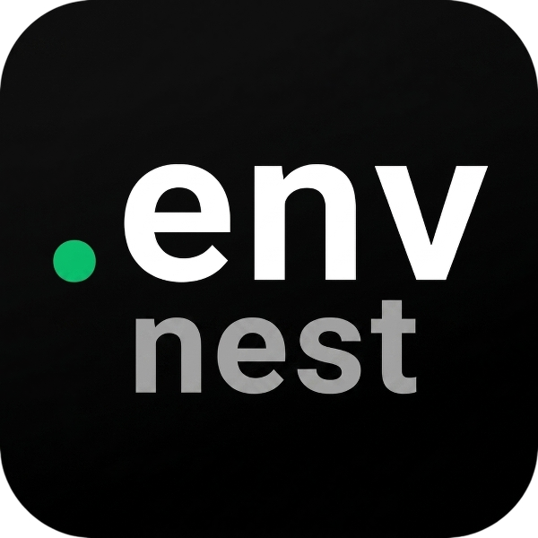

<div align="center">
  
  <h1>DotEnvNest</h1>
  <p><strong>A Secure, Beautiful, and Open-Source Platform to Manage Your .env Files</strong></p>

  [](https://opensource.org/licenses/MIT)
  [](https://nextjs.org/)
  [](https://react.dev/)
  [](https://tailwindcss.com/)
  [](https://www.mongodb.com/)
  [](https://www.typescriptlang.org/)
</div>

<br />

**DotEnvNest** is a full-stack developer tool built to securely store, manage, share, and retrieve project `.env` files. Never lose your environment variables again — and never accidentally expose them in plain text!

---

## ✨ Features

- **🔒 Double-Layer Encryption**: Your PIN is encrypted with a global AES-256-CBC secret before being stored in the database. Your `.env` content is then encrypted again using a key derived from your personal PIN. Your data stays private — even from the server owner.
- **💻 Built-in VSCode-style Editor**: Edit `.env` files in a beautiful Monaco-inspired editor with line numbers, syntax highlighting, and key counting.
- **🔄 Diff & Change Preview**: See exactly what keys were added, removed, or modified before saving any update.
- **🤝 Collaborative Sharing**: Share any project with teammates by email. Assign **Viewer** or **Editor** roles per person, change roles, or revoke access at any time.
- **🏷️ Tags & Filtering**: Organize projects with comma-separated tags. Filter and sort by newest, oldest, or last modified.
- **🔍 Global Search**: Instantly find environment configurations across all your projects by name or tag.
- **📋 Copy & Download**: One-click copy of the full `.env` content to clipboard, or download it directly as a `.env` file.
- **🖥️ CLI Tool**: Use the `dotenvnest` CLI to **push**, **pull**, **view**, or **diff** env vars — all secured with email + password authentication.
- **📧 Email Verification**: Secure sign-up flow with a 6-digit OTP sent to your email via Nodemailer/Gmail.
- **🚦 Rate Limiting**: Auth endpoints are protected by an Upstash Redis sliding-window rate limiter (5 requests / 15 min).
- **🎨 Dark / Light Mode**: Full dark and light theme support powered by `next-themes`.
- **🚀 PWA Support**: Install DotEnvNest on your device and use it like a native application with a registered Service Worker.
- **📱 Fully Responsive**: Optimised for mobile, tablet, and desktop breakpoints.

---

## 🛠️ Tech Stack

| Layer | Technology |
|---|---|
| **Framework** | [Next.js 16](https://nextjs.org/) — App Router, React Server Components |
| **UI** | [React 19](https://react.dev/) + [shadcn/ui](https://ui.shadcn.com/) + [Radix UI](https://www.radix-ui.com/) |
| **Styling** | [Tailwind CSS v4](https://tailwindcss.com/) + `tw-animate-css` |
| **Icons** | [Lucide React](https://lucide.dev/) + [Tabler Icons](https://tabler.io/icons) |
| **Database** | [MongoDB](https://www.mongodb.com/) (via official `mongodb` driver) |
| **Authentication** | Session JWTs signed with [jose](https://github.com/panva/jose), bcrypt password hashing |
| **Encryption** | AES-256-CBC (Node.js `crypto` module) — two-layer: global secret + user PIN |
| **Email** | [Nodemailer](https://nodemailer.com/) via Gmail SMTP |
| **Rate Limiting** | [Upstash Redis](https://upstash.com/) sliding-window limiter |
| **Data Fetching** | [TanStack React Query v5](https://tanstack.com/query/latest) |
| **Fonts** | Geist Sans + Geist Mono (Next.js Google Fonts) |
| **PWA** | Service Worker (`/sw.js`) + Web App Manifest |

---

## 🖥️ CLI Tool

DotEnvNest ships a powerful CLI with commands to **login**, **pull**, **push**, **find**, **share**, and **unshare** — all authenticated seamlessly via your browser.

### Installation

```bash
# Install globally
npm install -g dotenvnest
```

### Commands

#### `login` — Authenticate the CLI
Securely authenticates the CLI by opening your browser. If you are already logged in to the web application, the CLI will authenticate automatically! Otherwise, log in normally and your terminal will be authenticated.
```bash
dotenvnest login
```

#### `pull` — Download env vars from DotEnvNest
Downloads and decrypts the `.env` file from the specified project on DotEnvNest. Smartly detects if the project is shared with you without needing `--owner` in most cases.
```bash
dotenvnest pull <project-name>
dotenvnest pull <project-name> -f .env.local
```

#### `push` — Upload a local env file to DotEnvNest
Reads a local `.env` file, encrypts it with your PIN, and uploads it to DotEnvNest. Pushing a variant like `.env.local` automatically creates a new project variant `project-name.local`.
```bash
dotenvnest push <project-name>
dotenvnest push <project-name> -f .env.local
```

#### `find` — Search your projects
Lists your own projects and any projects that have been shared with you, along with the owner's email.
```bash
dotenvnest find
dotenvnest find api
```

#### `view` & `diff` — Inspect without downloading
- **`view`**: Prints the environment variables of a project securely in your terminal without saving a local `.env` file.
- **`diff`**: Compares your local `.env` file with the cloud version and highlights what was added, removed, or changed.
```bash
dotenvnest view <project-name>
dotenvnest diff <project-name>
```

#### `del` (or `delete`) — Delete a project
Permanently deletes a project that you own.
```bash
dotenvnest del <project-name>
```

#### `share` & `unshare` — Manage Access
Share a project directly from your terminal. Access can be either `read` or `edit`. You can also pass multiple comma-separated emails.
```bash
dotenvnest share my-api-server "colleague@example.com, manager@example.com" --access edit
dotenvnest unshare my-api-server "colleague@example.com, manager@example.com"
```

#### `leave` (or `exit`) — Leave a shared project
Removes your access from a project that someone else has shared with you.
```bash
dotenvnest leave <project-name>
```

### 🧠 Advanced Usage & Tips

#### 1. Understanding File Variants (`-f` / `--file`)
By default, the CLI looks for a file named `.env`. If you want to use a variant like `.env.local` or `.env.production`, you can use the `-f` flag.
When you push a variant, the CLI automatically maps it to a new project name in the cloud!
```bash
# Pushes to a project named "my-api"
dotenvnest push my-api

# Pushes to a new project named "my-api.local"
dotenvnest push my-api -f .env.local

# Pushes to a new project named "my-api.production"
dotenvnest push my-api -f .env.production
```
*Tip: When you run `dotenvnest find`, you will see all your variants listed as separate projects, keeping everything perfectly organized.*

#### 2. Handling Name Collisions (`--owner`)
Imagine you have a project named `backend`. Your friend also shares their project named `backend` with you.
If you run `dotenvnest pull backend`, the CLI gets confused and will ask you to specify the owner to avoid mistakes.
You can fix this by using the `--owner` flag:
```bash
# Pulls YOUR backend project
dotenvnest pull backend

# Pulls your FRIEND'S backend project
dotenvnest pull backend --owner friend@email.com
```
*Note: The `--owner` flag works perfectly with `push`, `pull`, `view`, and `diff`.*

#### CI/CD & Automation (GitHub Actions, Vercel)
You can use DotEnvNest in your CI/CD pipelines without running `dotenvnest login`. Simply export your auth token as an environment variable:
```bash
export DOTENVNEST_TOKEN="your_cli_token_here"
npx dotenvnest pull my-api-server
```
*(You can find your token inside `~/.dotenvnest-config.json` after logging in on your local machine).*

#### `docs` & `logout`
- `dotenvnest docs`: Opens the full documentation in your browser.
- `dotenvnest logout`: Clears your local authentication session.

---


## 🔐 Security Model

1. **Passwords** are hashed with `bcrypt` before storage.
2. **User PINs** are encrypted with AES-256-CBC using a server-side `ENCRYPTION_SECRET` before being stored.
3. **`.env` file content** is encrypted with AES-256-CBC using a key derived from the user's PIN (SHA-256 hash). The server **never** stores or knows the raw PIN at runtime — it is only supplied by the user during a session.
4. **Session tokens** are JWTs signed with `SESSION_SECRET` using the `jose` library.
5. **Auth endpoints** are protected with a sliding-window rate limiter (5 requests per 15 minutes per IP) via Upstash Redis.
6. **CLI pull/push** use email + bcrypt password verification (not API keys) so credentials are never stored locally.

---

## 🤝 Contributing

Contributions, bug reports, and feature requests are welcome!

1. Fork the repository
2. Create a feature branch: `git checkout -b feature/your-feature`
3. Commit your changes: `git commit -m 'feat: add your feature'`
4. Push to the branch: `git push origin feature/your-feature`
5. Open a Pull Request

Feel free to check the [issues page](https://github.com/muhammadsaif7717/dotenvnest/issues) for open tasks.

---

## 📝 License

This project is licensed under the [MIT License](./LICENSE).

---

*Created with ❤️ by [MD. SAIF ISLAM](https://github.com/muhammadsaif7717)*
